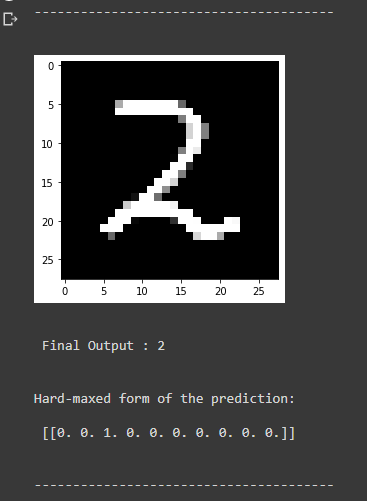
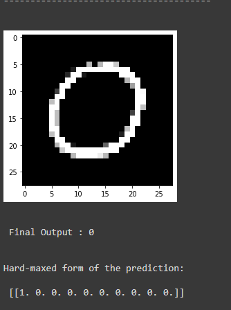
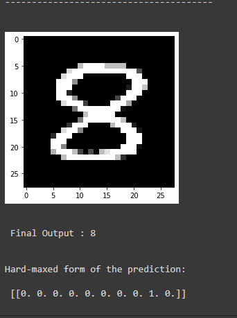
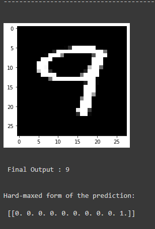

# Handwritten Digit Recognition Using Convolutional Neural Network


Handwritten digit recognition using neural network, trained on `60000` images from `MNIST dataset`.
## Getting Started

This example is only based on the python library ```keras``` to implement convolutional layers, maxpooling layers and fully-connected layers, also including backpropagation and gradients descent to train the network and cross entropy to evaluate the loss.

## Running the Codes
installing the requirements.
```
pip3 install -r requirements.txt
python main.py
```
# Requirements

* Python 3.5 +
* Keras (latest version)
* Numpy (+ mkl for Windows)
* Matplotlib

# Results
* learning rate: 0.01
* training accuracy: 0.97

### Sample Image 1

### Sample Image 2

### Sample Image 3

### Sample Image 4

